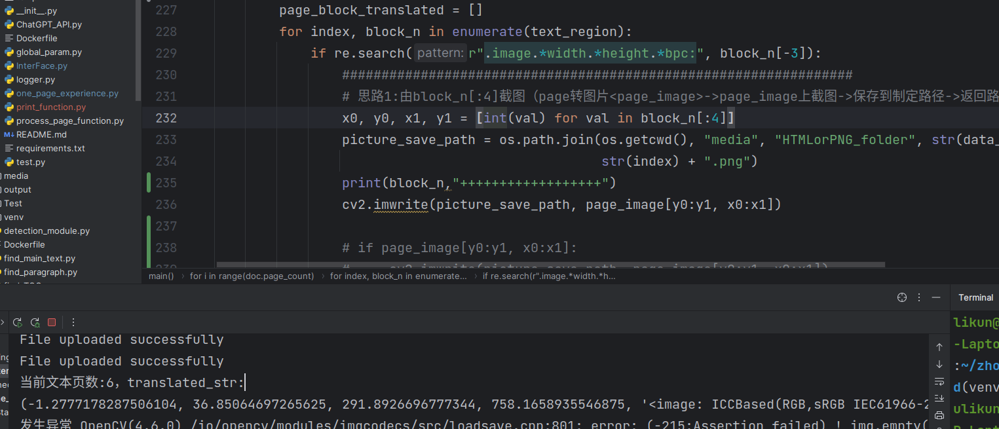
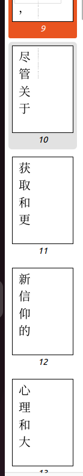
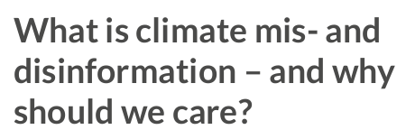
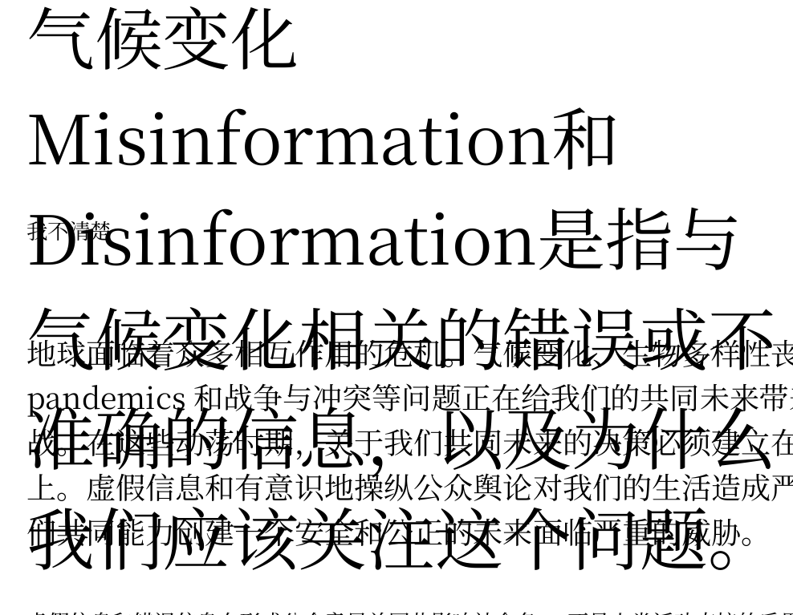

# 记录测试结果

2023.08.18 
**格式与内容提取问题**
问题:
- pymupdf输出的图片坐标会出现负数

措施:负数取0或都取绝对值

问题:
- main span size的选择问题:
 
原因:由于单个字符过大，影响整体内容
**翻译问题**
- 短句限定返回长度（修改调用的翻译接口参数，加入check_len字段）
- 只含数字和字符的返回原始字符
- AI对于反问句会回答

- 
